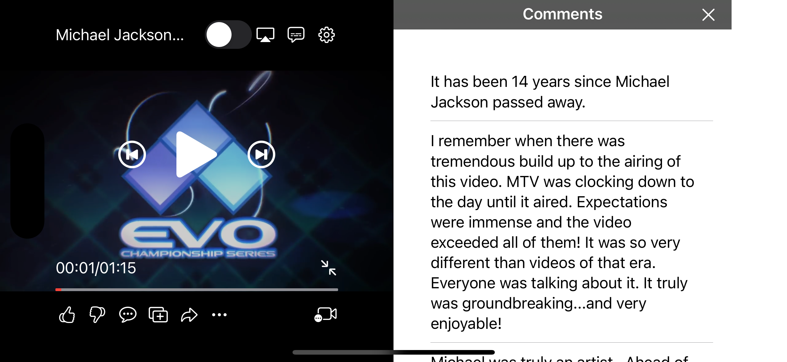
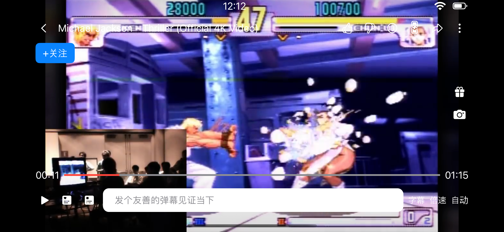

# VideoPlayerContainer

VideoPlayerContainer is a SwiftUI component as a video player. Compared with the system built-in one [VideoPlayer](https://developer.apple.com/documentation/avkit/videoplayer). the VideoPlayerContainer provides much more flexible and extendable abilities that are able to cover most of the common scenes that you can see on the apps such as Tiktok or Youtube.


## Showcase





## Example


Cloning the repo and opening up the Xcode project. you can see multiple schemas as examples. Run it respectively to feel what abilities this framework can offer and how easy to use this framework to meet your demands.

## Installation

VideoPlayerContainer supports multiple methods for installing the library in a project.

#### Installation with CocoaPods

To integrate VideoPlayerContainer into your Xcode project using CocoaPods, specify it in your `Podfile`:

```
pod 'VideoPlayerContainer', :git => 'https://github.com/MickeyHub/VideoPlayerContainer.git'
```

#### Installation with Swift Package Manager

Once you have your Swift package set up, adding VideoPlayerContainer as a dependency is as easy as adding it to the dependencies value of your Package.swift.

```
dependencies: [
    .package(url: "https://github.com/MickeyHub/VideoPlayerContainer.git", .upToNextMajor(from: "1.0.0"))
]
```

## Requirements

Since I use some of the new features like custom Layout, the current version is required a minimum `iOS` version of `16.0`, and `macOS` version of `13.0`. but I'm considering lowering the minimum version support to `iOS 14.0` and `macOS 12.4`

## Concept Before Usage

#### Context

Context is a core component and fully accessible from all of the other components in the VideoPlayerContainer, it holds a service locator which we can use to fetch other services to borrow expertise from other components

#### Widget

Widget is a View that's inside the VideoPlayerContainer which means it can access the context and in most cases, it has a specific service to handle all of its logic code.

#### Service

Service represents two roles, one role is a ViewModel in MVVM architecture, ViewModel handles all of the Output and Input for View. another role is responsible for communication with other services. we encourage people to write Service and Widget in one source file. this way, we can use `fileprivate`, and `private` to distinguish which APIs are used only for its Widget and which APIs are open to other services.

#### Overlay

Overlay In the VideoPlayerContainer, overlays are the sub-containers put inside the main container layer by layer and it's the place where widgets sit. we have 5 built-in overlays, from bottom to top, these are render, feature, plugin, control, toast. in addition, we allow users to insert their own overlay


#### Render Overlay

Render overlay is sitting at the far bottom of the container. it provides playback service and gesture services. you can use `context[RenderService.self]` to fetch `RenderService` or use `context[GestureService.self]` to fetch the `GestureService` respectively in your custom `Widget`. with RenderService, you can access the player instance which is an `AVPlayer`. you can also set up the gravity of the render canvas. with `GestureService`, you can observe predefined events like `tap`, `double-tap`, `long-press`, `drag`. `rotation`, `hover`, and `pinch`. for `tap`, `double-tap`. you can know if the touch is located on the left part or right part of the screen. for `drag`, you can know if the dragging event is done horizontally or vertically(left/right).

#### Feature Overlay

Feature overlay is used to pop up a panel from 4 directions (left, right, top, bottom). and we provide two styles: cover or squeeze. with squeeze style. when the popup panel shows up, the render canvas will be squeezed to the other side. like Youtube's comments Panel in fullscreen mode.

#### Plugin Overlay

Plugin Overlay is a sub-container without constraints on it. when you want to show up a widget that's not suitable for other overlays and you don't want to insert your own custom overlay, that's the right place for you. like a thumbnail preview widget for the seekbar on dragging or a simple widget that's visible only in a short time after being triggered.

#### Control Overlay

Control overlay is the most sophisticated overlay and the place where most work will be done. the control overlay is divided into 5 parts: `left`, `right`, `top`, `bottom`, and `center`. before going on, I need to introduce a concept called status: 

and we predefined 3 statuses as the screen style. these are `half-screen`, `fullscreen`, and `portrait`. this status change is 100% decided by yourself. but generally, `halfscreen` describes the status of the portrait device. `fullscreen` describes the landscape device and `portrait` describes the video the height is higher than the width.

For these 5 parts, you can configure them for different statuses which is quite common. for example, in halfscreen status, the screen is small and we can't attach many widgets to it but in fullscreen status. the video player container makes up the whole screen. we can attach many widgets to it to provide more and more functions.

for these parts, for these statuses, you can customize their shadow, transition, and layout. and other services can fetch the `ControlService` by `context[ControlService.self]` to call present or dismiss programmatically depending on the display style configured.


#### Toast Overlay

Toast Overlay is when you need to toast something in the container, you can use it to show a view on the left side. the view will be disappeared after a configured time. and the toast view is customizable.

## Usage: Add VideoPlayer

Let's say, we are going to code a player view in a video page, here. we need to import VideoPlayerContainer, and create a Context for the Video Player or the whole video page.

```swift

import VideoPlayerContainer

struct ContentView: View {
    
    @StateObject var context = Context()
    
    var body: some View {
    }
}

```

Now, you need to create the PlayerView to make it visible on the page. here, we use the Type `PlayerWidget`. it's the main container and requires a context instance to initialize it.

```swift

var body: some View {
    PlayerWidget(context)
}

```

The VideoPlayerContainer is now attached to the page. but you can't see it cuz we never do any configuration work and also don't pass the video resource item to play. let's do some more work ( specify the frame and play a video)

```swift

var body: some View {
    PlayerWidget(context)
        .frame(height: 300)
        .onAppear {

            /// play video
            let item = AVPlayerItem(url: Bundle.main.url(forResource: "demo", withExtension: "mp4")!)
            context[RenderService.self].player.replaceCurrentItem(with: item)
            context[RenderService.self].player.play()
        }
}

```

Run it, and the video will be playing. now, as you can see in other apps. we want to attach some widgets to it. like a `PlaybackButton` in the center.

## Usage: Write Widgets

As I said above, we need to write a PlaybackButton and attach it to the center of the Player View. first of all, we need to create a SwiftUI source file named PlaybackButtonWidget. and write a basic UI

```swift

struct PlaybackButtonWidget: View {
    var body: some View {
    	Image(systemName: "play.fill")
            .resizable()
            .scaledToFit()
            .foregroundColor(.white)
            .frame(width: 50, height: 50)
            .disabled(!service.clickable)
            .onTapGesture {
                /// tap handler
            }
    }
}

```

This is a view showing a Play icon. now, we need to attach it to the Player View. 

```swift

var body: some View {
    PlayerWidget(context)
        .frame(height: 300)
        .onAppear {

            /// add widgets to the center for halfscreen status
            let controlService = context[ControlService.self]
            controlService.configure(.halfScreen(center)) {[
                PlaybackButtonWidget()
            ]}

            /// play video
            let item = AVPlayerItem(url: Bundle.main.url(forResource: "demo", withExtension: "mp4")!)
            context[RenderService.self].player.replaceCurrentItem(with: item)
            context[RenderService.self].player.play()
        }
}

```

Now, you can see a icon on the center, and in default, you can tap the screen to make it visible or invisible. but you can see that we don't fill in logic code to make the icon works ( play and pause). How?

When we created the player view and passed in the context instance. the context instance will be put in the environment. so all of the widgets inside the video player container will have access to the context. Instead of accessing context directly on the Widget, we prefer using Service as the ViewModel to handle all of the functions of the Widget.

```swift

class PlaybackService: Service {
    
    private var rateObservation: NSKeyValueObservation?
    
    private var statusObservation: NSKeyValueObservation?
    
    @ViewState fileprivate var playOrPaused = false
    
    @ViewState fileprivate var clickable = false
    
    required init(_ context: Context) {
        super.init(context)
        
        let service = context[RenderService.self]
        rateObservation = service.player.observe(\.rate, options: [.old, .new, .initial]) { [weak self] player, change in
            self?.playOrPaused = player.rate > 0
        }
        
        statusObservation = service.player.observe(\.status, options: [.old, .new, .initial]) { [weak self] player, change in
            self?.clickable = player.status == .readyToPlay
        }
    }
    
    fileprivate func didClick() {
        
        let service = context[RenderService.self]
        if service.player.rate == 0 {
            service.player.play()
        } else {
            service.player.pause()
        }
    }
}

struct PlaybackWidget: View {
    var body: some View {
        WithService(PlaybackService.self) { service in
            Image(systemName: service.playOrPaused ? "pause.fill" : "play.fill")
                .resizable()
                .scaledToFit()
                .foregroundColor(.white)
                .frame(width: 50, height: 50)
                .disabled(!service.clickable)
                .onTapGesture {
                    service.didClick()
                }
        }
    }
}

```

As you can see above, it's a completed Widget. 

* we use fileprivate modifier to tell other users that they're only available on its own Widget. 
* we use @ViewState to mark the variable that's able to trigger the SwiftUI update mechanism.
* we use WithService as the Widget's root View to make sure any @ViewState variable changes will make the whole Widget involved in the update mechanism.
* we use @ViewState variable to condition which image to use in the Widget. (ViewModel's Output)
* we call service method to complete the widget's work (ViewModel's Input)

## Idea / Bug / Improvement

Please file an issue and I'll discuss it with you
 
## License

VideoPlayerContainer is released under the MIT license. See [LICENSE](LICENSE) for details.
